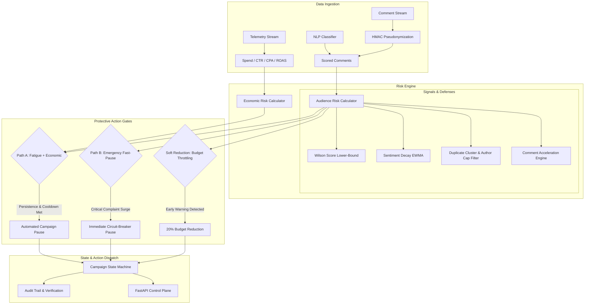

# AdFatigueRadar 📡

> **Real-Time Ad Fatigue & Audience Backlash Intelligence Engine**  
> An automated, mathematically guarded system that detects creative exhaustion, sentiment decay, and brand backlash to protect ad spend and brand equity.

---

## 🎯 Executive Overview

Modern digital advertising campaigns on platforms like Meta, TikTok, and YouTube suffer from two critical hazards:
1. **Ad Fatigue:** Audiences repeatedly exposed to the same creative stop engaging, leading to declining Click-Through Rates (CTR), escalating Cost-Per-Acquisition (CPA), and collapsing Return on Ad Spend (ROAS).
2. **Audience Backlash:** Negative sentiment, mockery, product defects, or controversial positioning can turn comment sections into liabilities, causing viral reputational harm while marketing budgets continue to feed the fire.

**AdFatigueRadar** bridges the gap between natural language audience signals and ad performance telemetry. By fusing real-time comment NLP classification with ad platform financial metrics, AdFatigueRadar autonomously evaluates multi-dimensional risk scores, enforces statistical confidence bounds, and executes deterministic protective actions (proactive budget throttling, automated campaign pausing, and emergency backlash circuit-breaking).

---

## 🏗️ System Architecture



---

## ✨ Key Capabilities

### 1. Dual-Path Automated Protection Gates
AdFatigueRadar uses an asymmetric, dual-path policy for automated interventions:
- **Path A (Fatigue & Economic Confirmation):** Designed for gradual creative decay. Requires sustained high Audience Risk ($\ge 0.85$) *and* verified Economic degradation (CPA increase or ROAS deterioration) sustained continuously for a 30-minute persistence window with active cooldown compliance.
- **Path B (Emergency Backlash Fast-Pause):** Designed for acute viral backlash (e.g., product safety defects, severe public relations backlash). Bypasses economic lag to trigger an immediate emergency pause if critical complaint rates breach statistical bounds.
- **Soft Reduction:** Automatically applies a 20% budget reduction (`SOFT_REDUCED` state) when early warning indicators cross warning thresholds, offering an automated path back to `ACTIVE` when audience sentiment recovers.

### 2. Statistical Rigor & Evidence Defense
- **Wilson Score Lower-Bound ($z = 1.96$):** Replaces naive ratio calculations with conservative confidence lower-bounds, preventing knee-jerk actions on low-volume statistical noise.
- **Anti-Brigade & Bot Defense:** Scans for duplicate comment clusters, emoji spam, and single-author comment stuffing. Caps individual author influence to prevent coordinated sabotage from triggering ad pauses.
- **Classifier Confidence Filtering:** Comments with classifier confidence below 0.85 are discarded from risk weighting.

### 3. Virtual Clock & Speed-Invariant Replay
- **Tick-Driven Simulation (`SimClock`):** Replay execution runs on deterministic 5-minute ticks, ensuring staleness monitoring, persistence windows, and cooldown timers fire accurately even during data lulls.
- **Reproducible Scenario Backtesting:** Historical scenarios can be replayed in accelerated virtual time without timing drifts, producing byte-for-byte identical state transitions across runs.

### 4. Enterprise Auditability & Safety Controls
- **Closed Reason Code Enumeration:** Every state transition, throttle, pause, or block logs an immutable audit event tagged with an actor (`SYSTEM` vs `OPERATOR`) and a standardized reason code.
- **Operator Overrides:** Manual pause, unpause, and safety-block capabilities with readback verification against campaign management adapters.

---

## 📊 Risk Signals & Formulas

| Signal | Source | Purpose | Normalization Range |
|---|---|---|---|
| **Harmful Negative Ratio** | Comments | Proportion of comments with severe negative sentiment weighted by Wilson LB | $0.10 \to 0.45$ |
| **Sentiment Decay** | Comments | Continuous polarity decay tracked via Exponentially Weighted Moving Average (EWMA $\alpha=0.30$) | $0.02 \to 0.15$ |
| **Fatigue & Mockery** | Comments | Combined volume share of creative mockery and fatigue complaints | $0.05 \to 0.35$ |
| **Comment Acceleration** | Comments | Normalized rate of comment volume change over baseline $(\Delta \text{Rate} / \max(\text{Rate}_{\text{prior}}, \epsilon))$ | $0.01 \to 0.10$ |
| **CTR Decay vs Frequency** | Telemetry | CTR drop correlated with ad frequency expansion | $5\% \to 40\%$ |
| **Critical Complaint Rate** | Comments | Product/service defect complaint volume triggering Path B | $0.02 \to 0.20$ |
| **Economic Confirmation** | Telemetry | CPA inflation ($\Delta \text{CPA}$) and ROAS collapse relative to campaign baseline | $5\% \to 40\%$ |

---

## 📁 Repository Structure

```text
AdFatigueRadar/
├── backend/
│   ├── main.py                     # FastAPI application entrypoint & middleware
│   ├── actions/                    # Action execution, simulation, & readback
│   │   ├── simulation.py           # Multiplier simulation & heartbeat synthesis
│   │   └── verification.py         # Readback retry loop & verification logic
│   ├── api/                        # HTTP REST API routers
│   │   ├── auth.py                 # Startup secret validation & CORS policy
│   │   ├── routes_campaigns.py     # Campaign metrics, registry, & status
│   │   ├── routes_actions.py       # Operator actions (pause, unpause, block)
│   │   ├── routes_thresholds.py    # Runtime threshold overrides
│   │   └── routes_webhooks.py      # Telemetry & comment ingest handlers
│   ├── models/                     # Frozen Pydantic schemas & contracts
│   │   └── backend_models.py       # Strict type contracts and enums
│   ├── replay/                     # Scenario replay engine & runner
│   │   └── runner.py               # Discrete SimClock replay loop
│   ├── risk/                       # Core Risk Evaluation Engine
│   │   ├── aggregation.py          # Rolling windows, deduplication, & SimClock
│   │   ├── audience_risk.py        # Composite audience risk scoring
│   │   ├── economic_risk.py        # Financial metric deterioration analysis
│   │   ├── features.py             # Signal extractors (EWMA, acceleration, clusters)
│   │   ├── gates.py                # Path A, Path B, and Soft Reduction gates
│   │   ├── normalization.py        # Min-max bounded clamping
│   │   ├── staleness.py            # Telemetry freshness monitors
│   │   ├── state_machine.py        # Deterministic campaign state transitions
│   │   └── wilson.py               # Wilson score confidence intervals
│   └── tests/                      # Comprehensive test suite (risk, API, gates, replay)
├── config/
│   └── thresholds.yaml             # Single source of truth for numeric thresholds
├── replay/
│   ├── schemas/                    # JSON Schemas for comment and telemetry events
│   └── scenarios/                  # Historical replay test datasets
├── scripts/
│   └── check_config.py             # Config validation & safe-bound verification
└── README.md                       # Project documentation
```

---

## 🚦 Campaign State Machine

```text
     ┌────────────────────────────────────────────────────────┐
     │                                                        │
     ▼                                                        │
[ ACTIVE ] ────────(Audience Warning)───────► [ SOFT_REDUCED ]
    │   ▲                                            │
    │   └────────(Sentiment Recovery 1.0h)───────────┘
    │
    ├───(Path A: Fatigue + Economic Confirmation)───► [ PAUSED ]
    ├───(Path B: Emergency Fast-Pause)──────────────► [ PAUSED ]
    ├───(Operator Manual Pause)─────────────────────► [ PAUSED ]
    │                                                    │
    │   ┌────────(Operator Manual Unpause)───────────────┘
    ▼   ▼
[ BLOCKED ] ◄────(Operator Manual Safety Lockout)
    │
    └────────────(Operator Manual Unblock)───► [ Prior State ]
```

- **`ACTIVE`:** Normal budget delivery; continuous rolling risk assessment.
- **`SOFT_REDUCED`:** Budget throttled to 80% (20% reduction); automatic recovery once risk drops below $0.60$ continuously for $1.0\text{h}$.
- **`PAUSED`:** Campaign delivery paused via API; zero ad spend. Requires manual operator review and explicit unpause.
- **`BLOCKED`:** Manual operator lock. Suspends all automated risk interventions until cleared.

---

## 🚀 Quickstart Guide

### Prerequisites
- Python 3.10+ (Python 3.11 recommended)
- `pip` or `uv`

### Installation

1. **Clone the repository:**
   ```bash
   git clone https://github.com/vinayr00/AdFatigueRadar.git
   cd AdFatigueRadar
   ```

2. **Create and activate a virtual environment:**
   ```bash
   python -m venv .venv
   # Windows:
   .venv\Scripts\activate
   # macOS/Linux:
   source .venv/bin/activate
   ```

3. **Install dependencies:**
   ```bash
   pip install -r requirements.txt
   # Or install core packages:
   pip install fastapi uvicorn pydantic pyyaml pytest
   ```

4. **Verify Configuration Integrity:**
   ```bash
   python scripts/check_config.py
   ```
   *Validates thresholds, weights sum to 1.0, gate monotonic ordering, and safe bound constraints.*

5. **Start the API Server:**
   ```bash
   uvicorn backend.main:app --host 0.0.0.0 --port 8000 --reload
   ```
   Interactive OpenAPI docs will be available at: `http://localhost:8000/docs`.

---

## 🧪 Testing

The test suite covers unit tests, mathematical verification, gate boundary conditions, concurrency, and simulated end-to-end replays:

```bash
# Run all backend tests
pytest backend/tests/ -v

# Run statistical risk engine tests
pytest backend/tests/risk/test_wilson.py backend/tests/risk/test_features.py -v

# Run gate boundary & state machine tests
pytest backend/tests/risk/test_gates_and_state.py -v
```

---

## 🔒 Security & Privacy

- **Privacy by Design:** Raw author IDs are replaced with keyed HMAC digests at the ingestion boundary; no personally identifiable audience information (PII) is stored in logs or persistence layers.
- **Security Headers:** Enforces `X-Content-Type-Options: nosniff` and `X-Frame-Options: DENY` on all HTTP responses.
- **Fail-Closed Architecture:** If required security keys (`ADFR_HMAC_SECRET`, `ADFR_API_KEY`) are missing, the server halts or fails closed to prevent unauthenticated operations.
- **Restricted CORS Policy:** Strict origin allowlists prevent unauthorized third-party origins from triggering control plane actions.

---

## 📄 License

This project is licensed under the Apache License 2.0. See the `LICENSE` file for details.
